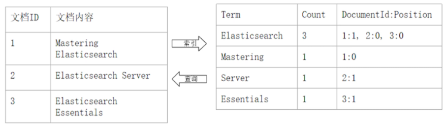
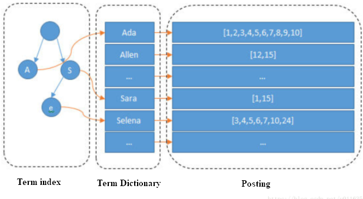
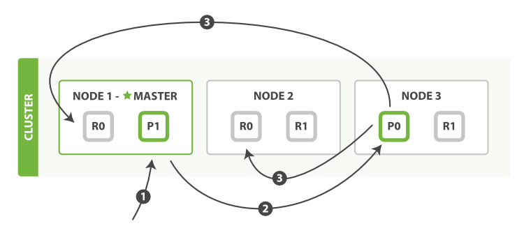
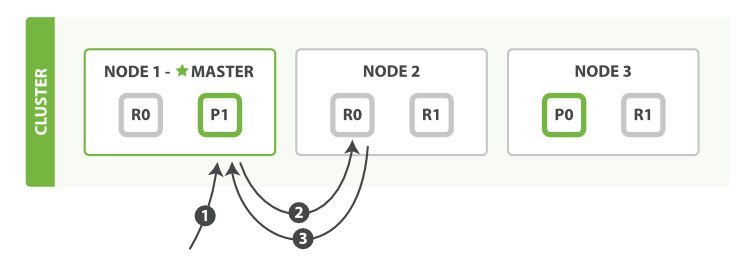
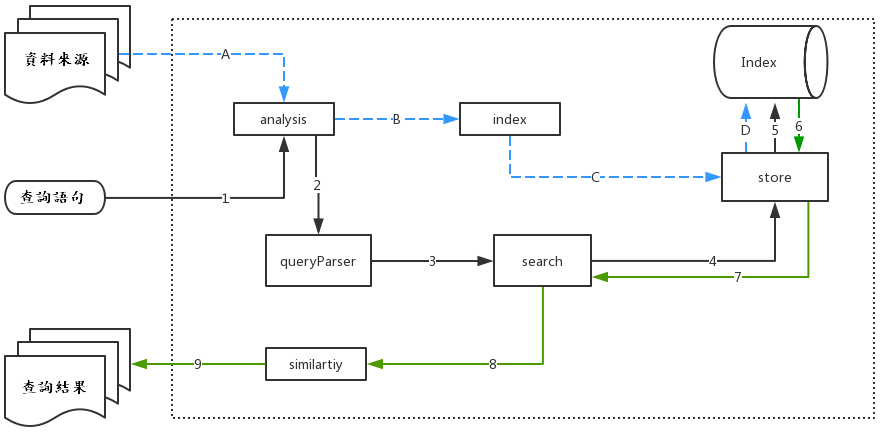
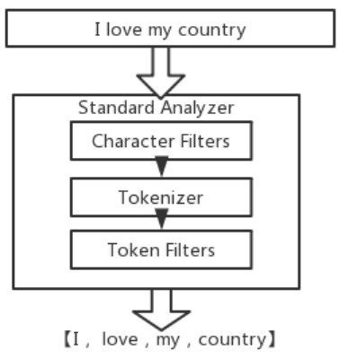

# Elasticsearch

Elasticsearch 是一個分佈式的免費開源搜索和分析引擎，適用於包括文本、數字、地理空間、結構化和非結構化數據等在內的所有類型的數據。Elasticsearch 在 Apache Lucene 的基礎上開發而成，由 Elasticsearch NV（即現在的 Elastic）於 2010 年首次發布。Elasticsearch 以其簡單的 REST 風格 API、分佈式特性、速度和可擴展性而聞名，是 Elastic Stack 的核心組件；Elastic Stack 是一套適用於數據採集、擴充、存儲、分析和可視化的免費開源工具。人們通常將 Elastic Stack 稱為 ELK Stack（代指 Elasticsearch、Logstash 和 Kibana），目前 Elastic Stack 包括一系列豐富的輕量型數據採集代理，這些代理統稱為 Beats，可用來向 Elasticsearch 發送數據。

## 基本概要

- Node 與 Cluster

  ES 本質上是一個分佈式資料庫，允許多台伺服器協同工作，每台伺服器可以運行多個 ES 實例。
  單個 ES 實例稱為一個節點(node),一組節點構成一個集群(cluster).

- 名詞介紹 - index:類似於 Mysql 裡面的一個資料庫,可以往裡面新增資料，查詢資料.(名稱必須是小寫) - document:資料內容,以 JSON 格式 - field:數據列,資料屬性 - mapping:數據的格式或規則, 如:設置某些 field 的數據類型,是否被索引等等.

| ElasticSearch     | 關聯資料庫       |
| ----------------- | ---------------- |
| 索引(Index)       | 資料庫(Database) |
| 文檔(Document)    | 數據行(Column)   |
| 欄位(Field)       | 數據列(Row)      |
| 類型(Type)        | 資料表(Table)    |
| 參數映射(Mapping) | 模式(Schema)     |

- primary shard(主分片):
  一臺伺服器，無法儲存大量的資料，ES 把一個 index 裡面的資料，分為多個 shard，分散式的儲存在各個伺服器上面.
- replica shard(副本分片):
  為了避免 primary shard 所在的機器掛掉,ES 能夠使用副本進行恢復.
  - 副本分片不與對應的主分放置於同一個節點上.
  - 搜索也可以在副本分片上運行.
- routing:
  當 index 一個 document 的時候，doc 會被存儲到一個主分片中. 透過 routing 計算應該存放到哪個分片中.查詢時則是將查詢命令同時給予所有分片.

```
shard = hash(routing) % number_of_primary_shards
```


---

## ES CRUD

- 建立 index

```sql
# PUT /<index>
PUT /products
```

- 在 index 中建立 document

```sql
# POST /<index>/_doc
POST /products/_doc
{
    "name": "coffee",
    "price": 64,
}
```

- 取得 document

```sql
# GET /_index/_type/[ID]
GET /products/_doc/10
```

- 更新 document
  - PUT 更新的範圍是整個 document, POST 的更新 document 必須已經存在，更新時只會對 document 中相對應的欄位作增量更新 or 對應欄位的修改
  - 實際上，Elasticsearch document 是無法修改的；而更新這個操作其實是新增一個新的 document，將原有的 \_version 加 1 後，舊的 document 被標示為 deletion

```sql
POST /products/_update/10
{
    "doc": {
        "price": 49
    }
}
```

- Deleteing index

```sql
DELETE /products
```

- 查詢表達式

```sql
POST movies/_search
{
  "query": {
    "match": {
      "title": "last christmas"
    }
  }
}
```

---

## Inverted Index(倒排索引)介紹

- Forward Index(正排索引)：Document ID 到 Document 內容到單詞的關聯
- Inverted Index(倒排索引)：單詞到 Document ID 的關係
  

- Inverted Index 組成
  
  - Term Index
    Term Dictionary 是在硬碟中作業，為了加速而盡量在記憶體中作業，但如果 term 太多，term dictionary 會很大，放記憶體不現實，於是有了 Term Index，就像字典裡的索引頁一樣，比如：A 開頭的 term ……… Xxx 頁；C 開頭的 term ……… Xxx 頁；E 開頭的 term ………Xxx 頁。
  - Term Dictionary
    Elasticsearch 為了能快速找到某個 term，將所有的 term 排個序，二分法查找 term，logN 的查找效率，就像通過字典查找一樣。
  - Posting List
    記錄了 Term 的出現 id

---

## 分片角度的數據操作流程

- 新增、刪除
  

  1. 客戶端給協調節點 Node1 發送新增或刪除的請求。
  2. 協調節點使用文檔的 id 確定文檔屬於分片 0。之後轉發請求到 Node3。
  3. Node3 在主分片上執行請求，如果成功，將轉發請求到相應的副本分片所屬的節點上。當所有的分片所屬的節點報告成功後，Node3 報告成功到請求的節點，請求的節點再報告給客戶端。

- 檢索 Get
  

  1. 客戶端給協調節點 Node1 發送 get 請求。
  2. 節點使用文檔的 id 確定文檔屬於分片 0。分片 0 對應的副本分片在三個節點上都有。此時，轉發請求到 Node2。
  3. Node2 返回文檔(document)給 Node1 然後返回給客戶端。

## 分詞角度的數據操作流程



- analysis：主要負責詞語分析及語言處理，也就是我們常說的分詞，通過該模塊可最終形成存儲或者搜索的最小單元 Term。
- index：主要負責 index 的創建工作。
- store：主要負責 index 的讀寫，主要是對文件的一些操作。
- queryParser：主要負責語法分析，把我們的查詢語句生成 Lucene 底層可以識別的條件。
- search：主要負責對 index 的搜索工作。
- similarity：主要負責相關性評分和排序的實現。

## 分詞

## 

分詞器是 ES 中專門處理分詞的組件,它的組成如下：

- Character Filters：針對原始文本進行處理，比如去除 html 標籤

- Tokenizer：將原始文本按照一定規則切分為單詞

- Token Filters：針對 Tokenizer 處理的單詞進行再加工，比如轉小寫、刪除或增新等處理

---

- Elasticsearch read data 使用自適應副本選擇（Adaptive Replica Selection, ARS）的技術.
- write 請求被路由到主分片，然後該主分片驗證操作，在本地執行操作並將其分發到其副本分片.
- write 請求若出現故障情況,使用 primary terms and sequence numbers

---

- ES 中的版本控制\_version 是防止文檔舊版本覆蓋較新版本的方法,如果寫入操作未按順序進行
  如下圖,假設客戶 A 已將商品添加到購物車，並完成了結帳流程,一旦發生這種情況，ES 就會檢索產品。
  同時，客戶 B 完成了同一產品的結帳流程，此時兩個線程都檢索到相同的產品。
  第一個線程將產品的“in_stock”減一，並通過 Elasticsearch API 更新產品。
  第二個線程做同樣的事情，這時會遇到問題。
  第二個線程認為取得“in_stock”的最新值，但是自檢索到產品以來，已從 6 個更新為 5 個。
  從不正確的值中減去一個，然後再次更新乘積，但具有相同的字段值。
  但是“in_stock”現在的值為 5，減去 1 應該為 4
  在這種情況下，可能會出售沒有庫存的產品，從而導致不良的客戶體驗。
  

## Dynamic Mapping

- 在寫入 Document 時，如果 index 不存在，則會自動建立 index
- Dynamic Mapping 可以根據 Document 內容，推算出 term data type 並自動建立 mapping，因此不需要手動制定
- 但推算的結果不一定會完全正確(例如：地理位置相關訊息可能會推斷錯誤)

## 手動 Mapping

```sql
PUT /users
{
    "mappings" : {
      "properties" : {
        "firstName" : {
          "type" : "text"
        },
        "lastName" : {
          "type" : "text"
        },
        //將 index 設定為 false，ES 就不會索引該 field 的資料
        "mobile" : {
          "type" : "text",
          "index": false
        }
      }
    }
}

// 新增資料
PUT /users/_doc/1
{
  "firstName":"Leon",
  "lastName": "Tseng",
  "mobile": "12345678"
}

// 搜尋會發生錯誤
// Cannot search on field [mobile] since it is not indexed.
POST /users/_search
{
  "query": {
    "match": {
      "mobile":"12345678"
    }
  }
}
```
