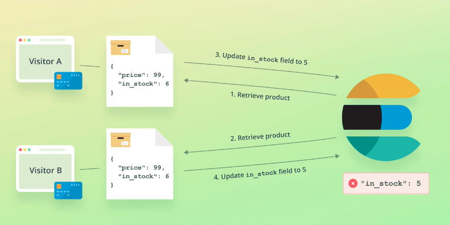

# Elasticsearch
Elasticsearch 是一個分佈式的免費開源搜索和分析引擎，適用於包括文本、數字、地理空間、結構化和非結構化數據等在內的所有類型的數據。Elasticsearch 在Apache Lucene 的基礎上開發而成，由Elasticsearch NV（即現在的Elastic）於2010 年首次發布。Elasticsearch 以其簡單的REST 風格API、分佈式特性、速度和可擴展性而聞名，是Elastic Stack 的核心組件；Elastic Stack 是一套適用於數據採集、擴充、存儲、分析和可視化的免費開源工具。人們通常將Elastic Stack 稱為ELK Stack（代指Elasticsearch、Logstash 和Kibana），目前Elastic Stack 包括一系列豐富的輕量型數據採集代理，這些代理統稱為Beats，可用來向Elasticsearch 發送數據。
## ES與關聯式資料庫
倒排索引
|  Id   | 內容  |
|  ----  | ----  |
| 1  | study elasticsearch |
| 2  | learn elasticsearch |
| 3 | elasticsearch method |

|  Term   | count  | Id |
|  ----  | ----  | ---- |
| elasticsearch  | 3 | 1,2,3 |
| study  | 1 | 1 |
| learn | 1 | 2 |
| method | 1 | 3 |

## 基本概要
- Node 與 Cluster

   ES本質上是一個分佈式資料庫，允許多台伺服器協同工作，每台伺服器可以運行多個ES實例。
   單個ES實例稱為一個節點(node),一組節點構成一個集群(cluster).

- 名詞介紹
    - index:類似於Mysql裡面的一個資料庫,可以往裡面新增資料，查詢資料.(名稱必須是小寫)
    - document:資料內容,以JSON格式
    - field:數據列,資料屬性
    - mapping:數據的格式或規則, 如:設置某些field的數據類型,是否被索引等等.

    |  ElasticSearch   | 關聯資料庫  |
    |  ----  | ----  |
    | 索引(Index)  | 資料庫(Database) |
    | 文檔(Document)  | 數據行(Column) |
    | 欄位(Field)  | 數據列(Row) |
    | 類型(Type) | 資料表(Table) |
    | 參數映射(Mapping)  | 模式(Schema) |

    - primary shard(主分片):
    一臺伺服器，無法儲存大量的資料，ES把一個index裡面的資料，分為多個shard，分散式的儲存在各個伺服器上面.
    - replica shard(副本分片):
    為了避免primary shard所在的機器掛掉,ES能夠使用副本進行恢復.
      - 副本分片不與對應的主分放置於同一個節點上.
      - 搜索也可以在副本分片上運行.
    - routing:
    當index一個document的時候，doc會被存儲到一個主分片中. 透過routing計算應該存放到哪個分片中.查詢時則是將查詢命令同時給予所有分片.
    ```
    shard = hash(routing) % number_of_primary_shards
    ```


---
- ES CRUD

    - 建立index
    ```sql
    # PUT /<index>
    PUT /products
    ```

    - 在index中建立document
    ```sql
    # POST /<index>/_doc
    POST /products/_doc
    {
        "name": "coffee",
        "price": 64,
    }
    ```

    - 取得document
    ```sql
    # GET /_index/_type/[ID]
    GET /products/_doc/10
    ``` 

    - 更新document
      - PUT 更新的範圍是整個 document, POST的更新 document 必須已經存在，更新時只會對 document 中相對應的欄位作增量更新 or 對應欄位的修改
      - 實際上，Elasticsearch document 是無法修改的；而更新這個操作其實是新增一個新的 document，將原有的 _version 加 1 後，舊的 document 被標示為 deletion
    ```sql
    POST /products/_update/10
    {
        "doc": {
            "price": 49
        }
    }
    ```

    - Deleteing index 
    ```sql
    DELETE /products
    ```

- 查詢表達式
```sql
POST movies/_search
{
  "query": {
    "match": {
      "title": "last christmas"
    }
  }
}
```

---
- Elasticsearch read data使用自適應副本選擇（Adaptive Replica Selection, ARS）的技術.
- write請求被路由到主分片，然後該主分片驗證操作，在本地執行操作並將其分發到其副本分片.
- write請求若出現故障情況,使用primary terms and sequence numbers
---
- ES中的版本控制_version是防止文檔舊版本覆蓋較新版本的方法,如果寫入操作未按順序進行
如下圖,假設客戶A已將商品添加到購物車，並完成了結帳流程,一旦發生這種情況，ES就會檢索產品。
同時，客戶B完成了同一產品的結帳流程，此時兩個線程都檢索到相同的產品。
第一個線程將產品的“in_stock”減一，並通過Elasticsearch API更新產品。
第二個線程做同樣的事情，這時會遇到問題。
第二個線程認為取得“in_stock”的最新值，但是自檢索到產品以來，已從6個更新為5個。
從不正確的值中減去一個，然後再次更新乘積，但具有相同的字段值。
但是“in_stock”現在的值為5，減去1應該為4
在這種情況下，可能會出售沒有庫存的產品，從而導致不良的客戶體驗。


## Dynamic Mapping
- 在寫入 Document 時，如果 index 不存在，則會自動建立 index
- Dynamic Mapping 可以根據 Document 內容，推算出 term data type 並自動建立 mapping，因此不需要手動制定
- 但推算的結果不一定會完全正確(例如：地理位置相關訊息可能會推斷錯誤)
## 手動Mapping
```sql
PUT /users
{
    "mappings" : {
      "properties" : {
        "firstName" : {
          "type" : "text"
        },
        "lastName" : {
          "type" : "text"
        },
        //將 index 設定為 false，ES 就不會索引該 field 的資料
        "mobile" : {
          "type" : "text",
          "index": false
        }
      }
    }
}

// 新增資料
PUT /users/_doc/1
{
  "firstName":"Leon",
  "lastName": "Tseng",
  "mobile": "12345678"
}

// 搜尋會發生錯誤
// Cannot search on field [mobile] since it is not indexed.
POST /users/_search
{
  "query": {
    "match": {
      "mobile":"12345678"
    }
  }
}
```